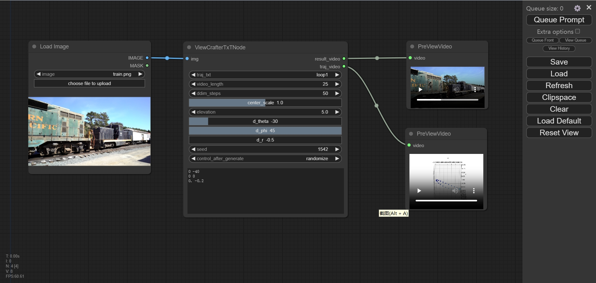

# ViewCrafter-ComfyUI
a custom node for [ViewCrafter](https://github.com/Drexubery/ViewCrafter)

## 教程
- [云端镜像](https://www.xiangongyun.com/image/detail/c37b0344-4ec0-4c78-8ca8-1866f166bb89)
- 
## Example
test on 4090D,py38,torch==1.3.1
|img|traj_text|output_traj_video|output_render_video|
|--|--|--|--|
||`left`|<video src="https://github.com/user-attachments/assets/03f976f7-ab4c-4796-a76c-c544d0ce4fdb" /> | <video src="https://github.com/user-attachments/assets/28fbad0f-74c7-4efd-8786-fe80f3403d1b" />|
||`loop1`|<video src="https://github.com/user-attachments/assets/1b1f9a3b-2094-4b03-9150-25629929f360" /> | <video src="https://github.com/user-attachments/assets/63b2cbf5-647f-44ed-8f8f-07b76e3bb701" />|

## traj point
you can refer [here](https://github.com/Drexubery/ViewCrafter/blob/main/docs/render_help.md)
